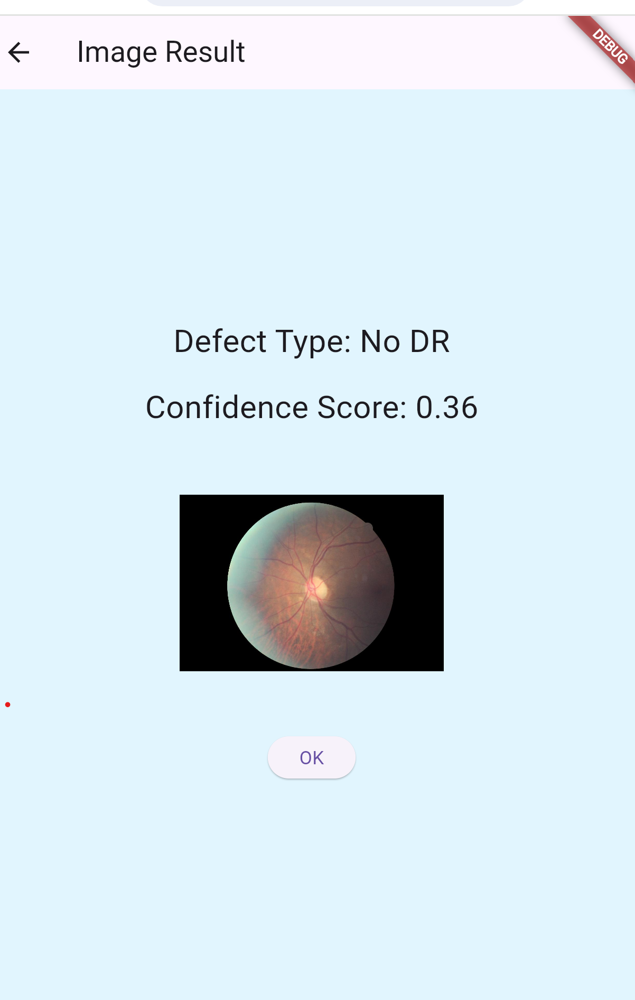

# eye_defect_detection

A Flutter app for detecting diabetic retinopathy stages using a custom trained TensorFlow Lite model.

## Getting Started

This Flutter project includes user authentication, image classification into 5 diabetic retinopathy stages, history tracking, and result display.

- The entire app logic is in `lib/main.dart` — login, registration, homepage, results, about, contact, logout.
- The TFLite model is located at `assets/model.tflite`.
- Dependencies and assets are defined in `pubspec.yaml`.

## Screenshots

### Login Screen  

### Home Page  

### Menu  

### Result Page  

## About

The app detects 5 stages of diabetic retinopathy:
- No DR
- Mild DR
- Moderate DR
- Severe DR
- Proliferative DR

The model was trained by us and converted to TensorFlow Lite for on-device inference.

---

For more info on Flutter and TensorFlow Lite:  
- [Flutter Docs](https://docs.flutter.dev/)  
- [TensorFlow Lite](https://www.tensorflow.org/lite)
